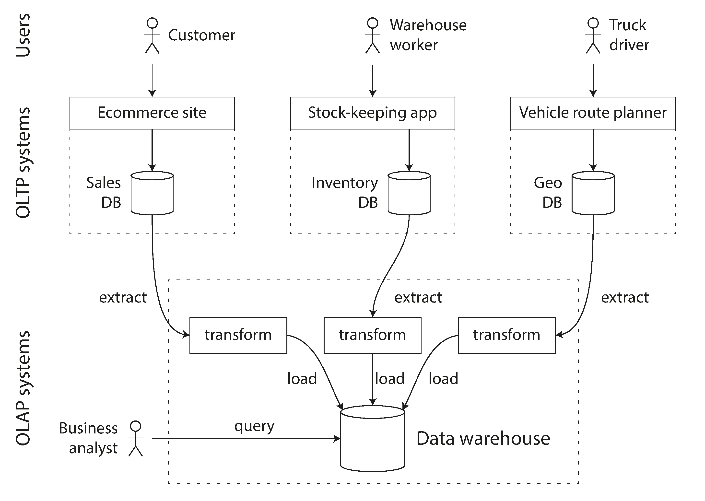
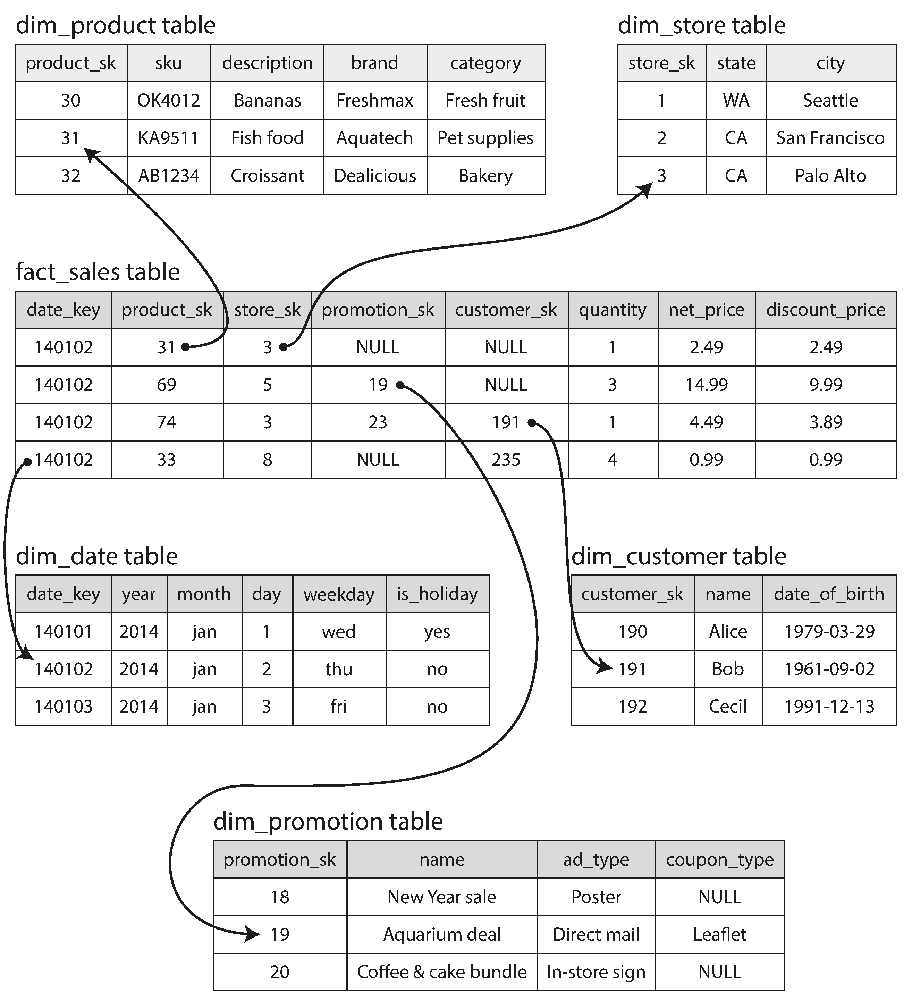

# Transaction Processing or Analytics

## Introduction

The traditional database systems are designed to handle transaction processing (OLTP). 
Lately databases have been designed to handle analytics (OLAP) as well.
Differences between the two are:

| Property          | OLTP                                                    | OLAP                                             |
|-------------------|---------------------------------------------------------|--------------------------------------------------|
| Purpose           | Manage transaction-oriented applications                | Analyze large volumes of data                    |
| Data Modification | Frequent, short transactions (insert, update, delete)   | Infrequent, complex queries (read-heavy)         |
| Data Volume       | Typically smaller, operational data                     | Large volumes of historical data                 |
| Query Complexity  | Simple queries, often predefined                        | Complex queries, often ad-hoc                    |
| Response Time     | Fast response times, typically milliseconds             | Longer response times, can be seconds to minutes |
| Schema            | Highly normalized, designed for transactional integrity | Denormalized, designed for query performance     |
| Example Use Cases | Banking transactions, order entry systems               | Business reporting, data mining, trend analysis  |

## Data Warehousing

- Data Warehousing = storing, collecting and processing data from various sources for business intelligence purposes.
- ETL = Extract, Transform, Load is the process representing Data Warehousing.

## Star Schema

star schema is a type of data warehouse schema that consists of a large central table (fact table) and multiple smaller 
tables (dimension tables) radiating from the central table like points on a star.

## Keywords

- ACID Transactions - Atomicity, Consistency, Isolation, Durability
- OLTP - Online Transaction Processing -  a type of data processing that consists of executing a number of transactions
occurring concurrently
- OLAP - Online Analytical Processing - a category of software tools that provide analysis of data stored in a database
- ETL - Extract, Transform, Load - a process in data warehousing responsible for pulling data out of the source systems
  
- Star Schema - One main table in the (fact table) in the middle of smaller focused tables (dimension tables); 
