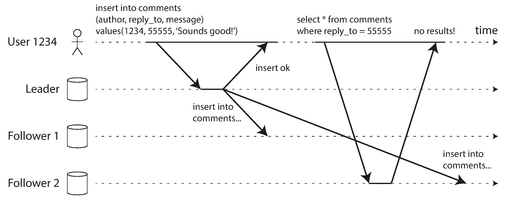
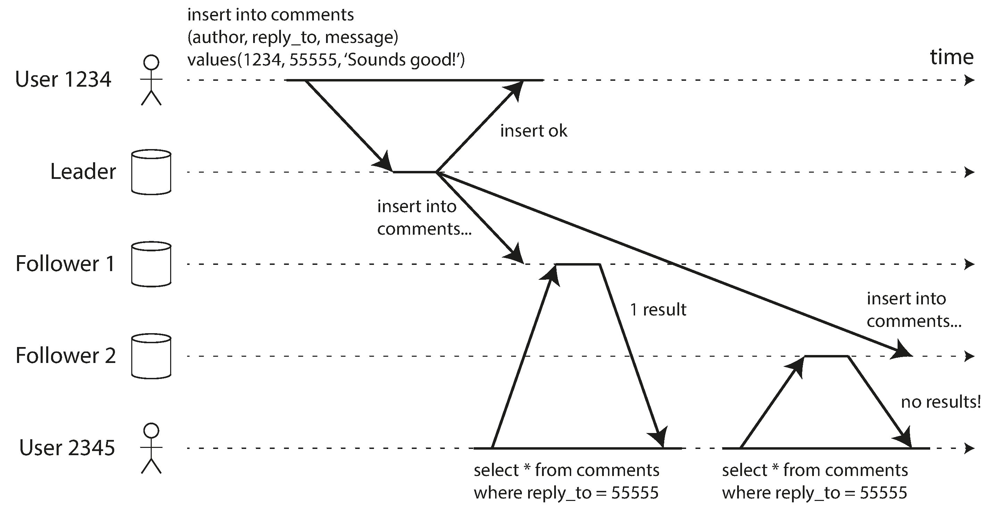
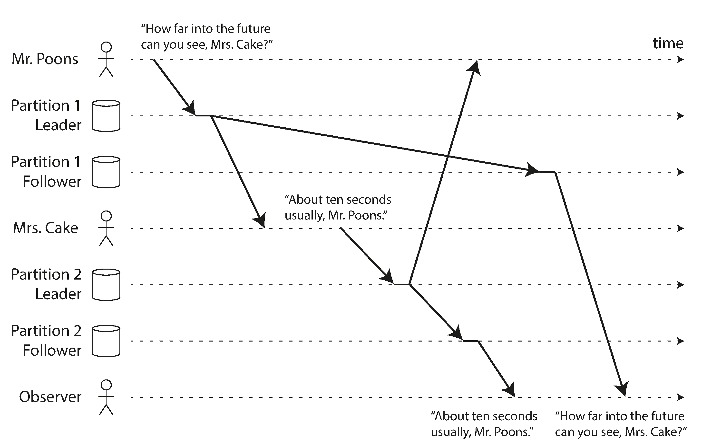

# Replication Lag Problems

Synchronous follower replication is unreliable because it adds a single point of failure.

Asynchronous replication is more reliable, but it can lead to replication lag problems.

## Reading your own writes
The common data synchronization issue:

- Read-after-write consistency
  - Makes the promise that once a write is acknowledged, the data will be available for reading.
  - No promises are made for what other users will see
- Implementation
  - For 1 minute after a write, the read is sent to the leader
  - Client can save timestamp of the write - use that to check for up-to-date data from replicas; retry otherwise
- If reading is done from multiple devices, there needs to be cross-device read-after-write consistency:
  - All users devices must be routed to the same datacenter

## Monotonic reads

- Monotonic reads = once a user has read a value, they will never see an older value
- Solution for overcoming this: each read request is sent to the same replica <- there is a replica per user based on user hash

## Consistent prefix reads

- Consistent prefix reads = once a user has read a value, they will never see an older value
- Solution for overcoming this: requests that are dependent on each other are sent to the same replica

