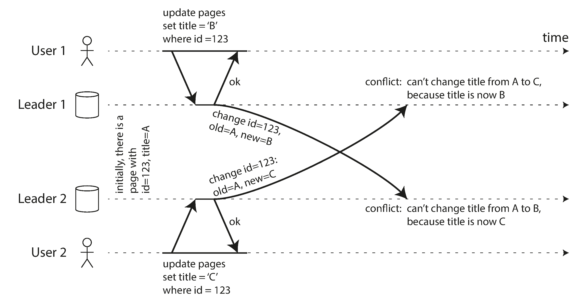
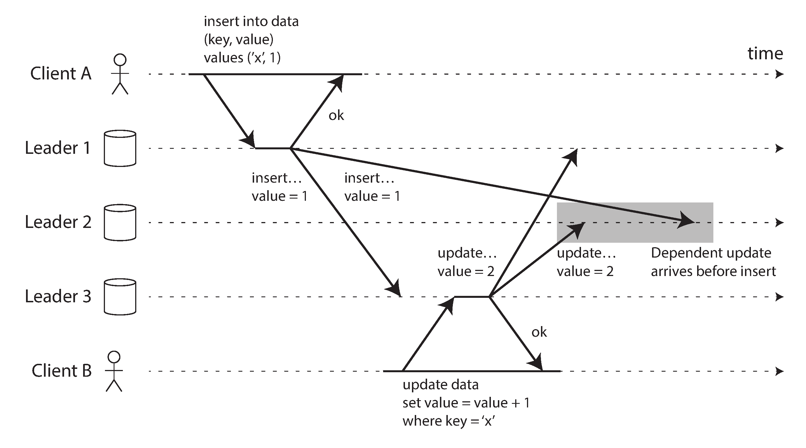

# Multi-Leader Replication

- You cannot count on a single leader to be available all the time for writes - so you need more.
- Multi-leader replication = multiple leaders can accept writes

## Use cases

- Multi-datacenter operation = to avoid having a single leader in a single datacenter, you can have one leader in each datacenter
- Clients with offline operation = e.g. mobile apps that can work offline and sync with the server when they are back online
- Collaborative applications = e.g. Google Docs, where multiple users can edit the same document at the same time
  - Question: how to handle live conflicts? R: use locks for users before editing

## Write conflicts

- Main issues
  - Write conflicts = two leaders write to the same data at the same time
  - Data loss = one leader overwrites the data of another leader
  - Data corruption = one leader writes to the data of another leader, but the data is not in a consistent state
- Solutions
  - Conflict avoidance - assign one user to one datacenter that is the leader for that user
  - Converging to consistent state 
    - give writes a timestamp/ID and use the latest write
    - merge the writes (e.g. for collaborative applications)
    - record the conflict in a data structure and resolve it later by prompting the user

## Multi-leader replication topologies

