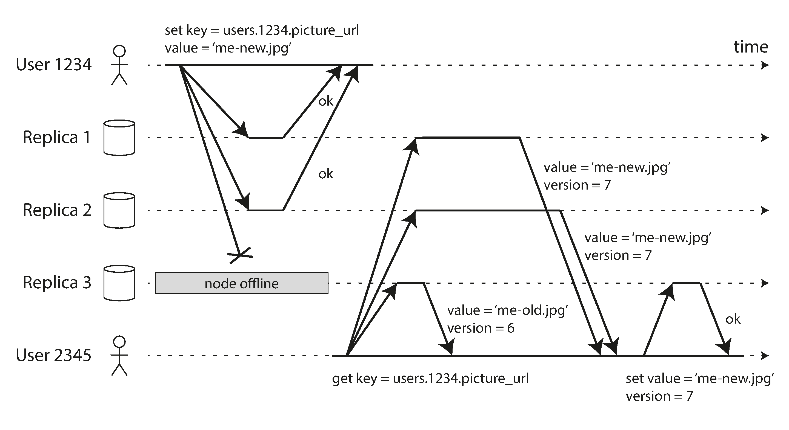
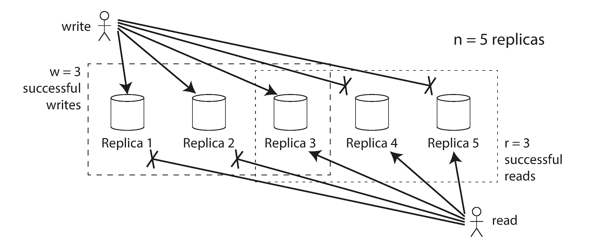

# Leaderless Replication

- Nodes that are not up receiving a write request will not be able to respond to read requests because they have outdated data.
  - To solve this, one read request must target multiple DB nodes and fetch the one with the most recent data. -> this is read repair

## Read repair

- The replication system must ensure that eventually all data is in all replicas
- Read repair = when a read request is sent to multiple replicas, and the entry with latest version is returned
  - Works well on more reads
- Anti-entropy = when a write request is sent to multiple replicas, the background system checks if the data is consistent across all replicas.

## Quorum reads and writes

- The quorum condition, `w + r > n`, allows the system to tolerate unavailable nodes as follows:
  - `w` = number of replicas that must acknowledge a write
  - `r` = number of replicas that must respond to a read
  - `n` = total number of replicas
- The quorum condition is not a silver bullet due to multiple edge-cases 

## Sloppy Quorums and Hinted Handoffs

- Is it better to return errors to all requests for which we cannot reach a quorum of w or r nodes?
- Or should we accept writes anyway, and write them to some nodes that are reachable but aren’t among the n nodes on which the value usually lives?
  - **Sloppy quorum** = write to a different node than the one that is usually used

## Detecting Concurrent Writes

- **LWW** (Last Write Wins) = the last write is the one that is kept