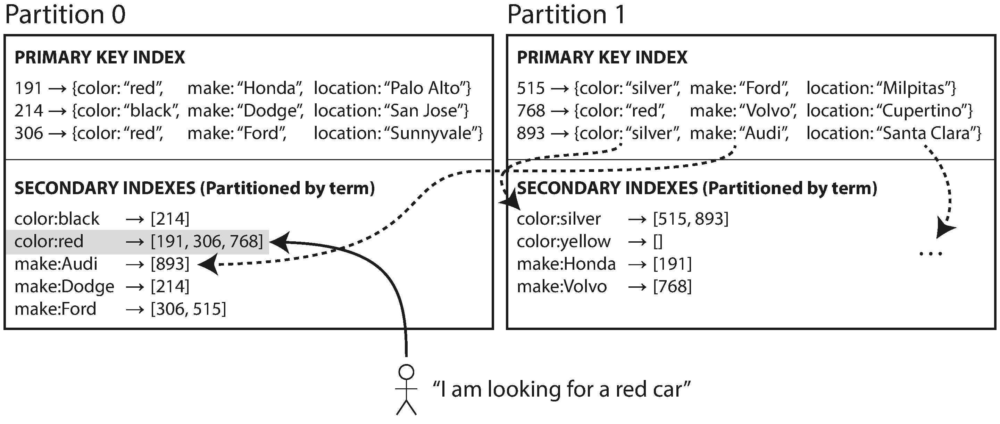

# Partitioning and secondary indexes

- Classic partitioning works if elements are only accessed by their primary key
- Secondary indexes are used to access elements by other keys
  - Example: indexing a table of cars by their color

## Secondary indexes by Document

- Uses Scatter/Gather strategy
- Have a local index in each partition for a specific attribute
- Expensive reads, fast writes, widely used (in Cassandra, MongoDB, etc.)

## Secondary indexes by Term

- Partitioning stays the same, but one partition serves the ids of elements from all partitions for a specific attribute
- Have a global index in all partitions for a specific attribute
- Fast reads, expensive writes, used in Oracle Warehouse

