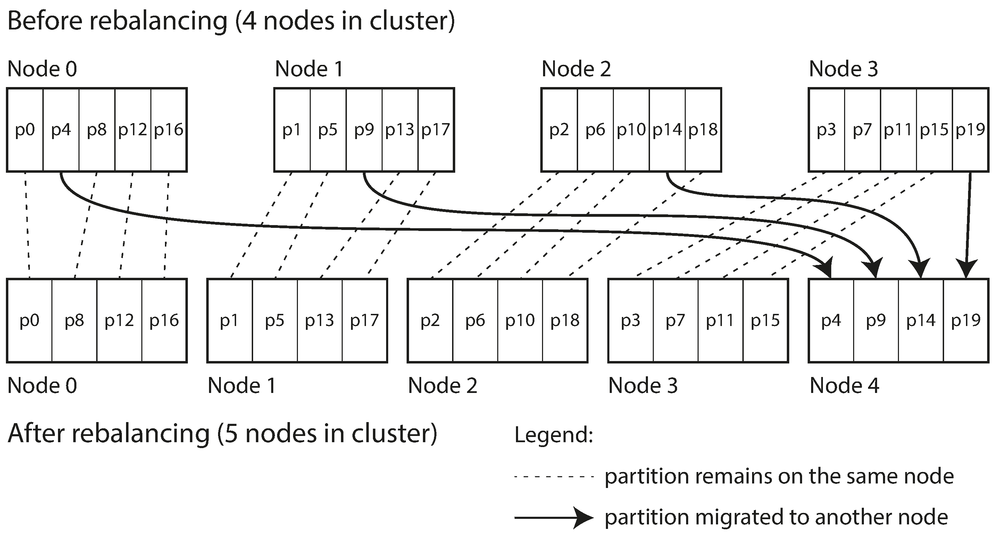

# Rebalancing partitions

- Over time, data changes, and the distribution becomes uneven
- Rebalancing partitions is a process of redistributing data across partitions to ensure even load and performance

## Strategies for Rebalancing

### Fixed number of partitions

- *DO NOT* use hash mod N (where N is the number of nodes)
  - logic breaks when adding a new partition because the entire data needs to be rebalanced
- An alternative is to: *Steal partitions* -> A newly added node steals one partition from each of the existing node

### Dynamic partitioning

- Partitioning by key-range poses the problem of having all data in one partition if the range is chosen incorrectly
- For this reason, the partitioning scheme must be dynamic
- HBase creates a new partition when the size of the partition exceeds a certain threshold, and splits the partition into two

